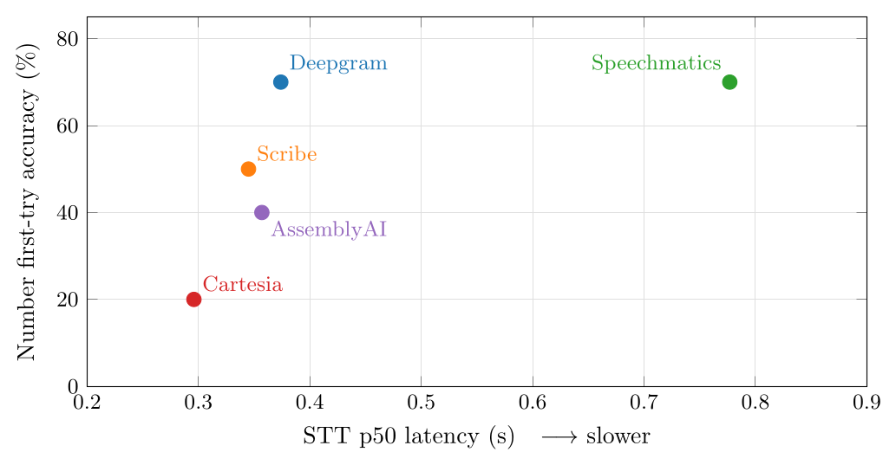

# The Best Speech-to-Text Engine for AI Voice Agents on the Telephony Layer

**A controlled comparison of five streaming STT engines in one identical PSTN pipeline.**

**Mazin Salim · Mishahal Palakuniyil** — MM Intelligence

📄 **[Read the paper (PDF)](paper/telephony-stt-benchmark.pdf)**  ·  🌐 **[Project page](https://therealmazin.github.io/telephony-stt-benchmark/)**

---

## Abstract

On the telephony layer, the latency of a speech-to-text (STT) engine is a *necessary but insufficient* property. The objective that actually matters for an AI voice agent is **accuracy and reliability under real public switched telephone network (PSTN) conditions**. We swapped five streaming STT engines into one identical [Pipecat](https://pipecat.ai) telephony pipeline — holding turn-taking, the language model, the text-to-speech, and the 8&nbsp;kHz audio path constant — and placed roughly ten live Twilio phone calls through each (about fifty total), every call requiring the assistant to capture a spoken **name** and a ten-digit **callback number**.

We find that **speed does not predict accuracy**: the fastest-median engine was the *least* reliable, hallucinating invented tokens and exhibiting a broken two-second latency tail. We also find that one does **not** have to trade speed for accuracy.

## Recommendation

> ### 🏆 Deepgram Nova-3 (STT) + ElevenLabs Flash v2.5 (TTS)

Deepgram's STT ties for the **best first-try number accuracy (70%)** with **zero permanent number losses** and **zero hallucination**, yet runs at roughly **half the latency** of the slowest accurate engine. It delivers accuracy, reliability, and speed in a single engine with no critical reliability weakness. We pair it with ElevenLabs for synthesis because Deepgram's own *Aura* text-to-speech — not its STT — interrupted and cut off speech on the line.

## Results at a glance

| STT engine | STT latency (p50) | Number accuracy (1st-try) | Hard name "Mazin" (exact) | Hallucination | Verdict |
|---|---:|---:|---:|---:|---|
| **Deepgram Nova-3** | 0.374 s | **70%** (tied best) | 1 | **0** | 🏆 **Recommended** |
| **AssemblyAI Universal-3 Pro** | 0.357 s | 40% | **3** (best) | **0** | Runner-up — best for names |
| **Speechmatics Ursa (Enhanced)** | 0.777 s | **70%** (tied best) | 0 | **0** | Accuracy alternative (~2× slower) |
| **ElevenLabs Scribe v2** | 0.345 s | 50% | 1 | **0** | Middle of the pack |
| **Cartesia Ink-Whisper** | 0.296 s | 20% | 1 | **9** | ❌ Disqualified (hallucinates) |



*The fastest engine (Cartesia) is the least accurate; the slowest (Speechmatics) is accurate but pays ~2× latency. Deepgram occupies the sweet spot: fast **and** accurate.*

## The thesis

1. **Speed ≠ accuracy.** Cartesia had the fastest median yet was the least reliable (9 hallucinated tokens, a 2-second p95 tail). Raw speed tells you nothing about correctness.
2. **You don't have to trade speed for accuracy.** Deepgram matches the most accurate engine on numbers while running twice as fast — so the slow engine's latency buys no accuracy advantage.
3. **Reliability spans the whole stack, not just the STT.** A voice agent must never hallucinate, must capture names and numbers correctly on a noisy 8&nbsp;kHz line, and must not cut the caller off — a turn-taking property that, as we found, can live in the **text-to-speech** layer as much as anywhere else.

## How it was measured

One Pipecat pipeline, one component swapped (the STT). Turn-taking (a local end-of-turn model over Silero VAD), the LLM (Claude Haiku 4.5), the TTS (ElevenLabs Flash v2.5), and the 8&nbsp;kHz → 16&nbsp;kHz audio path were held identical across all five engines. No vocabulary seeding. Latency was instrumented per service (time-to-first-token); number accuracy was scored from the assistant's spoken **read-back** of the caller's number; ground truth confirmed each batch ran its labelled engine. Full methodology, figures, and per-engine analysis are in the [paper](paper/telephony-stt-benchmark.pdf).

## Honest limitations

This is a **practical engineering benchmark, not a published academic study**. Single speaker (one voice, accent, microphone, handset), ~10 calls per engine, no ground-truth Word Error Rate, and an "AI read-back" accuracy proxy that mixes the STT with the language model. The TTS-interruption finding is a qualitative field observation, not a measured result. Treat the rankings as **directional**. A 70% vs 66% gap here is roughly one call.

## Citation

```bibtex
@techreport{telephony_stt_benchmark_2026,
  title  = {The Best Speech-to-Text Engine for AI Voice Agents on the Telephony Layer},
  author = {Salim, Mazin and Palakuniyil, Mishahal},
  institution = {MM Intelligence},
  year   = {2026},
  note   = {A controlled comparison of five streaming STT engines in one identical PSTN pipeline},
  url    = {https://github.com/therealmazin/telephony-stt-benchmark}
}
```

## License

The paper and this write-up are released under [CC BY 4.0](LICENSE). You are free to share and adapt with attribution.

---

*Engines compared: Deepgram Nova-3 · ElevenLabs Scribe v2 Realtime · Speechmatics Ursa (Enhanced) · AssemblyAI Universal-3 Pro · Cartesia Ink-Whisper. Telephony via Twilio. Pipeline via Pipecat.*
